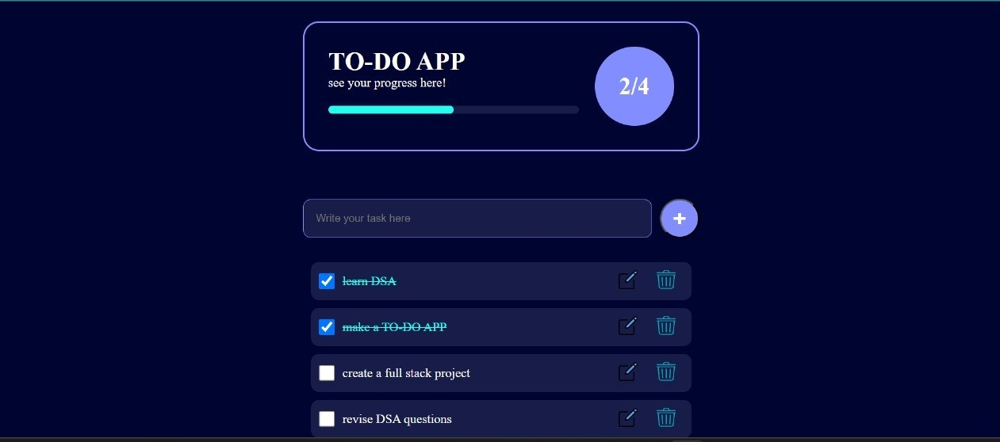

# To-Do List App

A simple and intuitive To-Do List app built with Html,Css and Js.

## Features
- Add, edit, and delete tasks
- Mark tasks as complete
- Responsive design
- Progress Bar

## Screenshot



## Getting Started

To get a local copy up and run, follow these steps:

```bash
# Clone the repository
git clone https://github.com/username/todo-list-app.git

# Install dependencies
npm install

# Start the app
npm start
